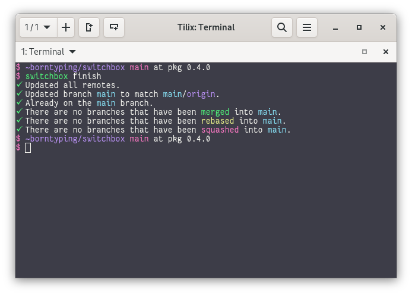

switchbox
=========

A collection of small tools for git workflows.



Installation
------------

Clone the repository and install the package with `pip`.

```zsh
pip install --user .
```

Usage
-----

Invoke `switchbox` directly or run it via `git switchbox`.

Switchbox commands assume your git repository has a default branch and a
default remote. When Switchbox is used for the first time (or you run
`switchbox setup`) it will find and remember names for these.

* The default branch will use a branch named `main` or `master`.
* The default remote will use a remote named `upstream` or `origin`.

Switchbox options are set in a repository's `.git/config` file under a
`switchbox` section.

### `switchbox config`

Show config options that Switchbox has set.

### `switchbox config init`

Detect a default branch and default remote, and save them to the repository's
git configuration. This will be done automatically when you first use a command
that works on a default branch or default remote.

### `switchbox config default-branch $branch`

Change the default branch.

### `switchbox config default-remote $remote`

Change the default remote.

### `switchbox finish [--update/--no-update]`

* Update all git remotes.
* Update the local default branch to match the remote default branch.
* Switch to the default branch.
* Remove branches **merged** into the default branch.
* Remove branches **squashed** into the default branch.

### `switchbox tidy [--update/--no-update]`

* Update all git remotes.
* Remove branches **merged** into the default branch.
* Remove branches **squashed** into the default branch.

### `switchbox update`

* Update all git remotes.
